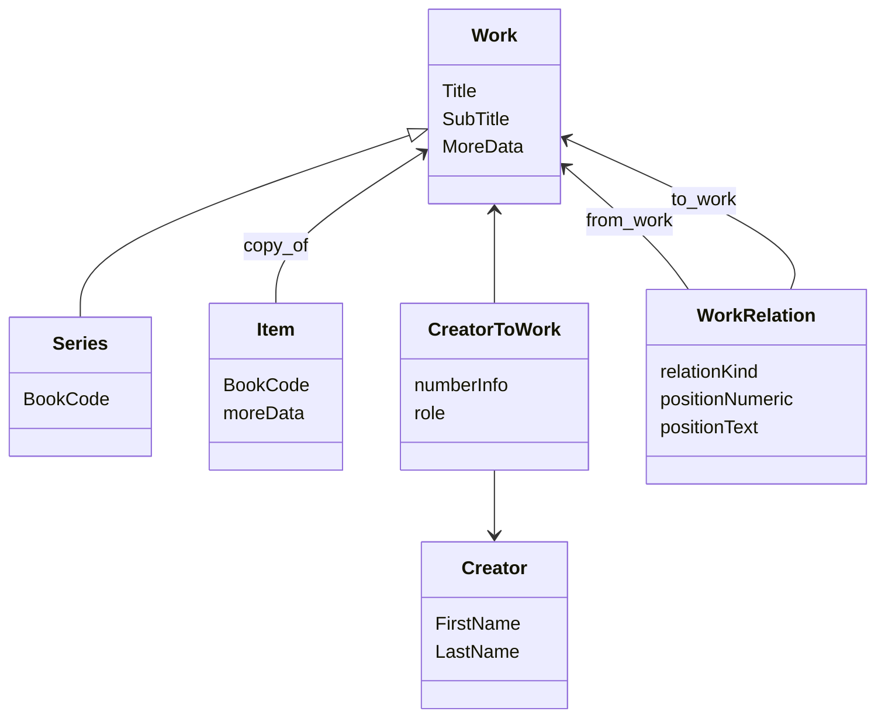

# The Works Datamodel
Some definitions of the classes:

- Work: The concept of some creative effort (series, publication, sub_work, etc)
- WorkRelation: describes the relation between two works
- CreatorToWork: describes the relation between a creator and a Work
- Creator: A person with a creative role in the production of works.
- Item: tracks a physical object that is a copy of a specific work.
- Series: A work with some extra info on where it should be located in the library.
  - Conceptually a series is a set of works that belong together. For instance, dune, lord of the rings, etc.

## Full Data Model
For context on how to reason about the WorkRelation, here's the data model that describes the information about works.

The fields here are incomplete, and should be used more to get an idea of what's going on.