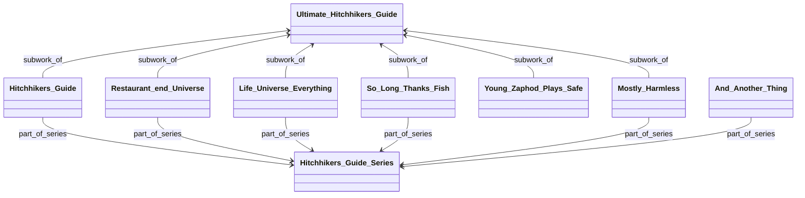

# WorkRelation
The WorkRelation model is used to store all relations between works. 

## Traversing the WorkRelations
Since the WorkRelation class has a source and a target, we can "walk" from work to work by following WorkRelation arrows. These "walking" options can be interpreted as a graph, where a node describes a specific work, every arrow a relationship between them.
Lets consider this example graph.  

We have multiple use-cases that require recursively traversing this graph. To facilitate this, the WorkRelation class has a method called `traverse_relations`.

Here's some examples of how it works.
### Example 1: Finding search terms for the Ultimate Hitchhikers Guide
When finding search terms for a book, we want to traverse both the subwork-relation, as well as the part_of_series relation.
We need to traverse the part_of_series relation in forwards direction, but the subwork_of relation in reverse.

In code terms, the following actually happens:
- First, the system looks up all the relevant relations to "Ultimate Hitchhikers Guide". This is the sub_work-relations to the works underneath it (eg. Restaurant at the End of the Universe).
- It continues recursively by looking at what new relations are available, and finds the series relations to the Hitchhikers Guide to the Galaxy series.
- Then it finds no further ways to progress, and thus ends its search there.

The result of this request is most arrows in the diagram; And_Another_Thing is not a part of it.
### Example 2: All works part of Hitchhikers_Guide_Series
This query starts from the series itself, and follows the part_of_series relationship in reverse. 
It thus finds the books in the series.
