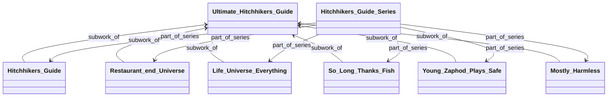

# WorkRelation
The WorkRelation model is used to store all relations between works. Some definitions of the classes:

- Work: The concept of some creative effort (series, publication, sub_work, etc)
- WorkRelation: describes the relation between two works
- CreatorToWork: describes the relation between a creator and a Work
- Creator: A person with a creative role in the production of works.
- Item: tracks a physical object that is a copy of a specific work.
- Series: A work with some extra info on where it should be located in the library.
  - Conceptually a series is a set of works that belong together. For instance, dune, lord of the rings, etc.

## Full Data Model
For context on how to reason about the WorkRelation, here's the data model that describes the information about works.

## Traversing the WorkRelations
Since the WorkRelation class has a source and a target, we can "walk" from work to work by following WorkRelation arrows. These "walking" options can be interpreted as a graph, where a node describes a specific work, every arrow a relationship between them.
Lets consider this example graph.  

We have multiple use-cases that require recursively traversing this graph. To facilitate this, the WorkRelation class has a method called `traverse_relations`.

Here's some examples of how it works.
